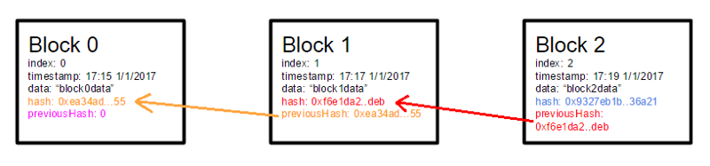

#### https://medium.com/@lhartikk/a-blockchain-in-200-lines-of-code-963cc1cc0e54
#### A blockchain in 200 lines of code

#### EXCERPTS

        class Block {
            constructor(index, previousHash, timestamp, data, hash) {
                this.index = index;
                this.previousHash = previousHash.toString();
                this.timestamp = timestamp;
                this.data = data;
                this.hash = hash.toString();
            }
        }
